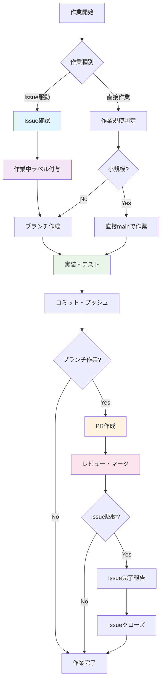

# CONTRIBUTING.md

Kumihan-Formatter への貢献ガイドライン

## 📋 目次

1. [開発ワークフロー](#-開発ワークフロー)
2. [作業種別と手順](#-作業種別と手順)
3. [Pull Request](#-pull-request)
4. [Issue管理](#-issue管理)
5. [コーディング規約](#-コーディング規約)
6. [テスト・リンター](#-テストリンター)

---

## 🔄 開発ワークフロー

### フロー図



### 作業完了の定義

**基本原則**: すべての作業において **コミット・プッシュまでが最低限の作業完了**

| 作業種別 | 作業完了の条件 |
|---------|---------------|
| **Issue駆動開発** | コミット・プッシュ + PR作成・マージ + Issue完了報告・クローズ |
| **直接作業（小規模）** | コミット・プッシュ |
| **直接作業（中〜大規模）** | コミット・プッシュ + PR作成・マージ |

---

## 📝 作業種別と手順

### 1. Issue駆動開発（推奨）

新機能・バグ修正・大規模変更は必ずIssue駆動で行ってください。

#### 手順
1. **Issue確認・分析**
   - 既存Issueの確認、または新規Issue作成
   - 作業内容と範囲の明確化

2. **作業開始**
   ```bash
   # 作業中ラベル付与
   gh issue edit {ISSUE_NUMBER} --add-label "作業中"
   
   # ブランチ作成
   git checkout -b fix/issue-{番号}-{概要}
   # または
   git checkout -b feature/issue-{番号}-{概要}
   ```

3. **実装・テスト**
   - コード実装
   - テスト実行（`make test`）
   - リンター実行（`make lint`）

4. **完了処理**
   ```bash
   # コミット・プッシュ
   git add .
   git commit -m "fix: Issue #XXX の概要"
   git push -u origin ブランチ名
   
   # PR作成
   gh pr create --title "タイトル" --body "Closes #XXX"
   
   # レビュー・マージ
   # Issue完了報告・クローズ
   ```

### 2. 直接作業

緊急修正や小規模な変更の場合。

#### 小規模変更（直接mainブランチOK）
- **条件**: タイポ修正、簡単なドキュメント更新、1ファイル・数行程度の変更
- **手順**: 
  ```bash
  # mainブランチで直接作業
  git checkout main
  git pull origin main
  # 変更作業
  git add .
  git commit -m "docs: タイポ修正"
  git push origin main
  ```

#### 中〜大規模変更（ブランチ作業）
- **条件**: 複数ファイル変更、機能追加、リファクタリング
- **手順**: Issue駆動開発と同様（Issueなしでブランチ作成・PR）

---

## 🔍 Pull Request

### 作成タイミング
- **必須**: Issue駆動開発、中〜大規模変更
- **任意**: 小規模な直接作業

### PR作成手順

```bash
gh pr create --title "適切なタイトル" --body "$(cat <<'EOF'
## Summary
変更内容の概要

## Changes
- 変更点1
- 変更点2

## Test plan
- [ ] テスト項目1
- [ ] テスト項目2

Closes #XXX (該当する場合)
EOF
)"
```

### レビューコメントの記載方法

#### ✅ Approved例
```
## レビュー結果: ✅ Approved

### レビュー観点
1. **コード品質**: 既存のコーディング規約に準拠しているか
2. **テスト**: 変更に対する適切なテストが実施されているか
3. **ドキュメント**: 必要な更新が行われているか
4. **影響範囲**: 他の機能への影響がないか

### 確認結果
- ✅ Black によるフォーマットが適用されている
- ✅ 型ヒントが適切に使用されている
- ✅ テストが全てパスしている（make test で確認）
- ✅ 変更内容が Issue #XXX の要件を満たしている

このPRは問題なくマージ可能です。
```

#### ❌ Changes Requested例
```
## レビュー結果: ❌ Changes Requested

### レビュー観点と問題点
1. **テスト不足**: 新規追加した機能に対するテストケースがありません
   - `src/new_feature.py` の `process_data()` メソッドのテストを追加してください

2. **エラーハンドリング**: 異常系の処理が不十分です
   - ファイル読み込み失敗時の例外処理を追加してください（src/utils.py:45）

修正後、再度レビューします。
```

---

## 📋 Issue管理

### ラベル管理
- **作業開始時**: 「作業中」ラベル付与
- **作業完了時**: 「完了待ち」ラベル付与
- **完全終了時**: Issueクローズ

### Issue完了報告

Issue駆動開発完了時は、Issueに詳細な完了報告をコメントしてください。

```markdown
## 作業完了報告

### 実施内容
- 実装した機能・修正内容
- 変更したファイル一覧
- テスト結果

### 確認事項
- [ ] 期待動作の確認
- [ ] テスト全パス
- [ ] ドキュメント更新

### PR
- #XXX でマージ済み

作業完了のため、Issueをクローズします。
```

---

## 💻 コーディング規約

- **Python**: 3.8+ 対応
- **フォーマット**: Black適用
- **型ヒント**: 積極的に使用
- **ドキュメント**: 主要クラスに設計参照コメント付与

### コミット前クリーンアップ

必ず以下のファイル・ディレクトリを削除してからコミット：

```bash
# 一時ファイル削除
rm -rf .pytest_cache/ .tmp.*/ __pycache__/ *.pyc *.log
rm -rf *test*.html test*/ dist/test_* *-output/
```

---

## 🧪 テスト・リンター

### テスト実行
```bash
make test
```

### リンター実行
```bash
make lint
```

### ドキュメント更新
- 変更内容は `CHANGELOG.md` に記録
- API変更時は `docs/` と `README.md` を更新

---

## 🌿 ブランチ戦略

- **`main`**: 安定版（保護ブランチ）
- **`feature/*`**: 新機能開発
- **`fix/*`**: バグ修正
- **`docs/*`**: ドキュメント更新

**重要**: mainブランチは保護されているため、大規模変更は必ずブランチ作成→PR経由で行ってください。

---

**開発を楽しみましょう！ 🎉**