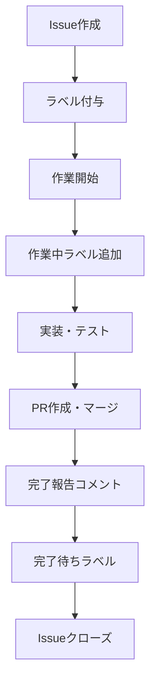

# ISSUE_TEMPLATE.md

Kumihan-Formatter のIssue管理テンプレート集

## 📋 目次

1. [Issue完了報告テンプレート](#-issue完了報告テンプレート)
2. [Issue作成テンプレート](#-issue作成テンプレート)
3. [使用方法](#-使用方法)

---

## ✅ Issue完了報告テンプレート

Issue駆動開発完了時は、Issueに以下のテンプレートを使用して詳細な完了報告をコメントしてください。

```markdown
## 作業完了報告

### 実施内容
- 実装した機能・修正内容
- 変更したファイル一覧
- テスト結果

### 確認事項
- [ ] 期待動作の確認
- [ ] テスト全パス
- [ ] ドキュメント更新

### PR
- #XXX でマージ済み

作業完了のため、Issueをクローズします。
```

---

## 📝 Issue作成テンプレート

### バグ報告テンプレート

```markdown
## バグ報告

### 環境
- OS: 
- Python バージョン: 
- Kumihan-Formatter バージョン: 

### 再現手順
1. 
2. 
3. 

### 期待する動作

### 実際の動作

### エラーメッセージ
```

### 機能要望テンプレート

```markdown
## 機能要望

### 概要
実現したい機能の概要を記載

### 背景・動機
なぜこの機能が必要なのか

### 詳細仕様
- 
- 
- 

### 受け入れ条件
- [ ] 
- [ ] 
- [ ] 

### 参考資料
```

### ドキュメント改善テンプレート

```markdown
## ドキュメント改善

### 対象ドキュメント
- ファイル名: 
- セクション: 

### 現在の問題
何が分かりにくい・不足しているか

### 改善提案
どのように改善すべきか

### 優先度
- [ ] 高（重要な情報が欠けている）
- [ ] 中（理解しやすさの改善）
- [ ] 低（軽微な修正）
```

---

## 🎯 使用方法

### Issue完了報告の手順

1. **作業完了時**: 上記テンプレートをコピー
2. **内容記入**: 実際の作業内容に合わせて記入
3. **Issueコメント**: 該当IssueにコメントとしてPOST
4. **ラベル更新**: 「作業中」→「完了待ち」
5. **Issueクローズ**: 報告後にクローズ

### Issue作成時の注意点

1. **適切なテンプレート選択**: 内容に応じてテンプレート選択
2. **ラベル付与**: @./LABEL_GUIDE.md に従ってラベル付与
3. **詳細記入**: テンプレートの各項目を具体的に記入

---

## 📊 Issue状態管理

### ラベルによる状態管理

| 状態 | ラベル | 説明 |
|------|-------|------|
| 新規作成 | カテゴリ + 優先度 | Issue作成直後 |
| 作業開始 | + 作業中 | 作業着手時 |
| 作業完了 | + 完了待ち | 作業完了、クローズ待ち |
| 完全終了 | （削除） | Issueクローズ |

### Issue完了フロー



---

## 🏷️ ラベル付与例

### バグ報告Issue
```
ラベル: バグ, 通常, パーサー
```

### 機能要望Issue
```
ラベル: 機能改善, 低優先度, 困難, レンダラー
```

### ドキュメント改善Issue
```
ラベル: ドキュメント, 通常, 簡単
```

---

**適切なIssue管理で効率的な開発を！ 📋**