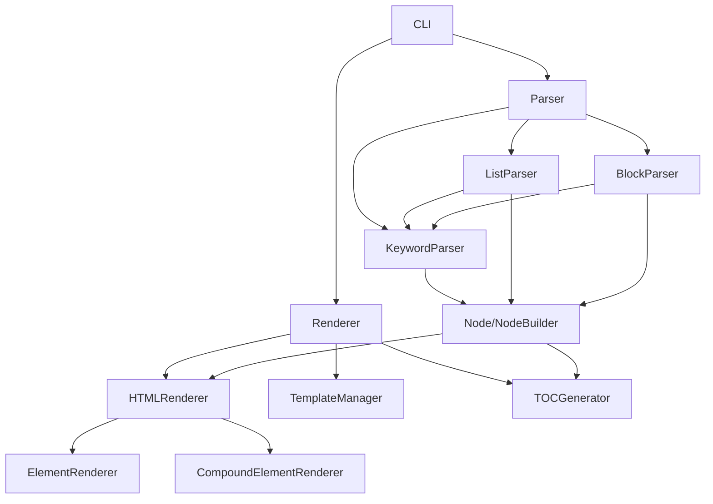

# Kumihan-Formatter クラス依存関係マップ

> AI開発・コンテキスト最適化のためのクラス関係図

## 📊 全体アーキテクチャ



## 🔄 パーサー系依存関係

### Parser (統括)
```python
# 依存: KeywordParser, ListParser, BlockParser
# 責務: 解析フロー制御、特化パーサー統括
```

### 特化パーサー依存チェーン
```
Parser
├── KeywordParser ← Node構築の中核
├── ListParser ← KeywordParser使用
└── BlockParser ← KeywordParser使用
```

### 共通依存
```
全パーサー → Node, NodeBuilder (AST構築)
全パーサー → error_node (エラー処理)
```

## 🎨 レンダラー系依存関係

### Renderer (統括)
```python
# 依存: HTMLRenderer, TemplateManager, TOCGenerator
# 責務: レンダリングフロー制御、出力統括
```

### レンダリング依存チェーン
```
Renderer
├── HTMLRenderer ← ElementRenderer使用
├── TemplateManager ← Jinja2統合
└── TOCGenerator ← Node解析
```

### HTML出力依存
```
HTMLRenderer → ElementRenderer → html_utils
HTMLRenderer → CompoundElementRenderer
```

## ⚙️ 設定・エラー処理系

### 設定管理
```
SimpleConfig ← Renderer (簡素化済み)
ConfigValidator ← EnhancedConfig (レガシー)
```

### エラー処理
```
ErrorHandler → ErrorFactory → UserFriendlyError
ErrorHandler → console_ui (表示)
```

## 🔗 重要な依存関係詳細

### Parser → 特化パーサー
- **初期化時**: 各特化パーサーのインスタンス作成
- **実行時**: 行タイプ判定後、適切なパーサーに委譲

### KeywordParser → Node構築
- **単一ブロック**: `NodeBuilder(tag).content().build()`
- **複合ブロック**: ネスト順序でタグ重ね合わせ

### Renderer → 出力系
- **AST処理**: HTMLRenderer にNode配列を委譲
- **テンプレート**: TemplateManager でHTML生成
- **目次**: TOCGenerator で見出し収集

## 🔄 循環依存の管理

### HTMLRenderer ⟷ ElementRenderer
```python
# 意図的な循環依存（委譲パターン）
HTMLRenderer._main_renderer = self
ElementRenderer._main_renderer = renderer
```

**理由**: ElementRenderer が親レンダラーに再帰的にレンダリングを委譲

## 📋 AI開発時の参照優先順位

### 1. コアクラス（最重要）
- **Parser** - 解析統括
- **Renderer** - 出力統括  
- **Node/NodeBuilder** - AST中核

### 2. 特化クラス（重要）
- **KeywordParser** - 記法解析
- **HTMLRenderer** - HTML生成
- **TemplateManager** - テンプレート

### 3. サポートクラス（補助）
- **ErrorHandler** - エラー処理
- **TOCGenerator** - 目次生成
- **console_ui** - UI表示

## 🎯 AI開発時の注意点

1. **Parser系修正時**: 必ずKeywordParserへの影響を確認
2. **Renderer系修正時**: ElementRendererとの循環依存を考慮
3. **Node構造変更時**: Parser/Renderer両方への影響大
4. **エラー処理追加時**: ErrorHandlerを経由して一元化

このマップを参照することで、コンテキスト圧縮時でも適切なクラス間関係を維持できます。