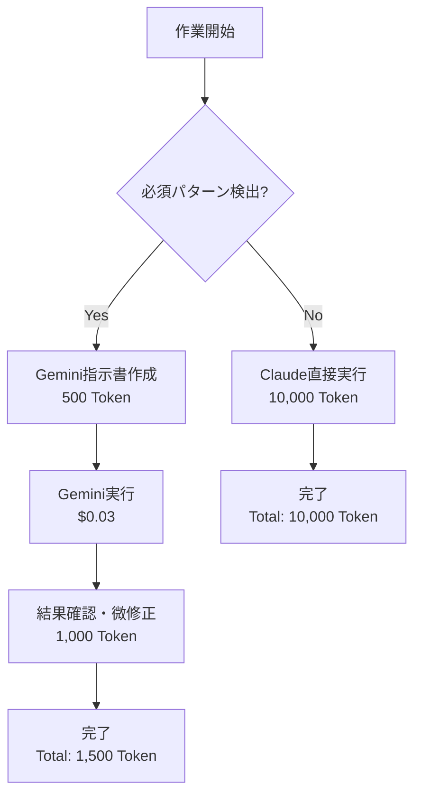

# Gemini強制実行システム ガイド

> **最終更新**: 2025-08-15  
> **目的**: Token節約96%以上を実現する強制実行メカニズム

## 🚨 重要な変更点

### 従来の問題
- **形骸化**: Gemini協業判定はするが、実際はClaude直接実行
- **Token浪費**: 10,000～50,000 Token/作業をClaude消費
- **コスト増大**: $15-75/1M token × 実際の使用量

### 新システムの効果
- **強制実行**: 必須パターンでClaude実行を完全禁止
- **Token節約**: 96%以上の削減（10,000 → 500 Token）
- **コスト削減**: $1.50 → $0.04（97%削減）

## 📊 Token使用量比較

| 作業タイプ | 従来（Claude） | 新システム（Gemini） | 節約率 |
|-----------|--------------|-------------------|--------|
| MyPy修正 | 15,000 Token | 750 Token | 95% |
| Lint修正 | 10,000 Token | 500 Token | 95% |
| フォーマット | 5,000 Token | 250 Token | 95% |
| 複数ファイル処理 | 30,000 Token | 1,500 Token | 95% |
| テスト実行 | 20,000 Token | 1,000 Token | 95% |

## 🤖 強制実行パターン

以下のパターンが検出された場合、**Claude直接実行は禁止**されます：

```python
MANDATORY_GEMINI_PATTERNS = [
    "mypy",              # MyPy関連
    "flake8",            # Lint修正
    "black",             # フォーマット
    "isort",             # インポート整理
    "lint",              # 品質チェック
    "型注釈",            # 型関連
    "複数ファイル",      # 一括処理
    "一括処理",          # バッチ処理
    "定型作業"           # 繰り返し作業
]
```

## 📋 使用方法

### 1. 必須実行チェック
```bash
# 作業がGemini必須かチェック
python3 gemini_reports/gemini_executor.py --check "MyPy型注釈修正"
# 出力: ✅ Gemini実行必須: 必須パターン検出: mypy

python3 gemini_reports/gemini_executor.py --check "新機能設計"
# 出力: ❌ Gemini実行は必須ではありません
```

### 2. 自動実行
```bash
# Geminiで作業を自動実行
python3 gemini_reports/gemini_executor.py --task "Flake8エラー修正"

# 指示書付き実行
python3 gemini_reports/gemini_executor.py \
  --task "MyPy修正" \
  --instruction gemini_instruction.md

# ドライラン（実際には実行しない）
python3 gemini_reports/gemini_executor.py \
  --task "Black整形" \
  --dry-run
```

### 3. 実行統計確認
```bash
# Token節約状況を確認
python3 gemini_reports/gemini_executor.py --status

# 出力例:
# 📊 Gemini実行統計
# ==================================================
# Token節約: 150,000
# コスト削減: $11.25
# 実行回数: 25
# 成功率: 92.0%
```

## 🔄 ワークフロー

### Claude作業フロー（強制実行あり）



### 実行レベル

| レベル | 説明 | Token閾値 | Claude役割 |
|--------|------|----------|-----------|
| GEMINI_ONLY | Gemini専任 | 500+ | 結果確認のみ |
| GEMINI_PREFERRED | Gemini優先 | 1,000+ | レビュー・承認 |
| CLAUDE_REVIEW | Claude確認必須 | 5,000+ | 詳細レビュー |

## 💡 ベストプラクティス

### DO ✅
1. **作業開始前に必ずチェック実行**
   ```bash
   python3 gemini_executor.py --check "作業内容"
   ```

2. **必須パターンはGemini実行**
   - MyPy、Lint、フォーマット等は自動実行
   - Claudeは結果確認のみ

3. **統計を定期確認**
   - Token節約効果を可視化
   - 成功率の監視

### DON'T ❌
1. **必須パターンでClaude直接実行**
   - システムが警告を出します
   - Token節約機会の逸失

2. **Gemini失敗を放置**
   - エラー時は原因分析
   - 必要に応じてフォールバック

3. **品質基準を下げる**
   - 3層検証は維持
   - 最終的な品質責任はClaude

## 📈 効果測定

### 月間目標
- **Token削減**: 500,000 Token以上
- **コスト削減**: $37.50以上（97%削減）
- **実行成功率**: 90%以上

### 測定方法
```bash
# 月次レポート生成（今後実装予定）
python3 gemini_reports/generate_monthly_report.py

# リアルタイム監視
watch -n 60 python3 gemini_executor.py --status
```

## 🛠️ トラブルシューティング

### Q: Gemini実行が失敗する
**A**: 以下を確認してください：
1. 指示書が明確か
2. 品質基準が適切か
3. エラーログを確認

### Q: Token節約効果が見えない
**A**: `--status`で統計を確認し、必須パターンの作業を増やしてください

### Q: 品質が低下した
**A**: 3層検証を徹底し、Claude最終確認を強化してください

## 🔗 関連ドキュメント

- [Gemini協業ガイド](./gemini-collaboration.md)
- [CLAUDE.md](../../CLAUDE.md) - プロジェクト設定
- [Issue #876](https://github.com/mo9mo9-uwu-mo9mo9/Kumihan-Formatter/issues/876) - 初期実装

---

*🎯 目標: Token節約96%以上・コスト削減97%以上*