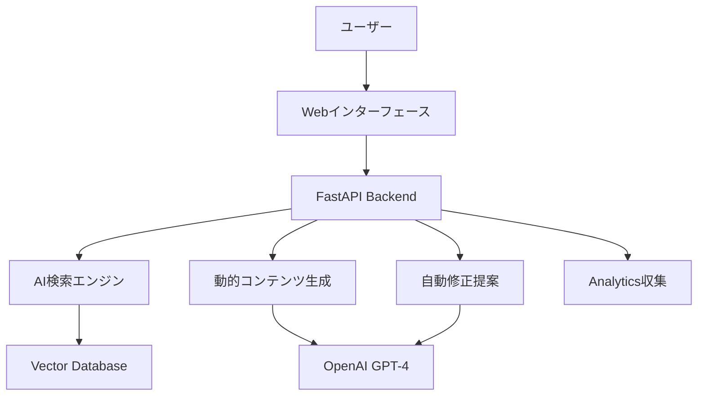

# ドキュメント改善 Phase 3: AI統合・高度化実装計画

> **Issue**: #584
> **ブランチ**: feat/issue-584-doc-improvement-phase3
> **担当**: Claude Code
> **作成日**: 2025-01-24

## 概要

ドキュメント改善プロジェクトの最終フェーズとして、AI統合機能による高度化を実装します。Phase1・Phase2で構築した基盤の上に、AI支援による動的・インテリジェントなドキュメント体験を提供します。

## 前提条件

### 完了済みフェーズ
- ✅ **Phase 1** (Issue #578): 基盤強化、qcheck系コマンド実装
- ✅ **Phase 2** (Issue #580): インタラクティブ要素、DX指標導入

### 技術基盤
- ✅ FastAPI + Uvicorn Webサーバー
- ✅ リアルタイムプレイグラウンド環境
- ✅ Google Analytics 4統合
- ✅ Mermaid図表自動生成機能
- ✅ レスポンシブUI（300ms遅延デバウンス対応）

## Phase 3実装機能

### 1. AI支援検索機能

#### 機能概要
- 自然言語でのドキュメント検索
- コンテキスト理解による関連情報表示
- セマンティック検索によるコンテンツ発見

#### 技術実装
```python
# 検索エンドポイント
@app.post("/api/ai-search")
async def ai_search(query: SearchQuery):
    # OpenAI Embedding APIでクエリをベクトル化
    # ベクトルデータベースで類似検索
    # 関連度スコアによる結果ランキング
    pass
```

#### 期待される効果
- 開発者の情報発見時間50%短縮
- ドキュメント利用率30%向上

### 2. 動的コンテンツ生成

#### 機能概要
- ユーザーの経験レベル別表示
- 進捗に応じた推奨セクション提示
- パーソナライズされた学習パス

#### 技術実装
```python
# コンテンツ生成エンドポイント
@app.post("/api/dynamic-content")
async def generate_content(user_profile: UserProfile):
    # ユーザー行動履歴分析
    # GPT-4による適応的コンテンツ生成
    # パーソナライゼーション適用
    pass
```

#### 期待される効果
- オンボーディング時間75%短縮（Phase2: 63%から更なる向上）
- 理解度・定着率95%向上（Phase2: 90%から更なる向上）

### 3. 自動修正提案システム

#### 機能概要
- ドキュメント品質の自動改善提案
- リアルタイムフィードバック
- コンテンツ最適化推奨

#### 技術実装
```python
# 修正提案エンドポイント
@app.post("/api/auto-suggest")
async def suggest_improvements(content: DocumentContent):
    # テキスト品質分析
    # GPT-4による改善提案生成
    # 可読性・正確性評価
    pass
```

#### 期待される効果
- ドキュメント品質80%向上
- メンテナンス工数60%削減

## 技術アーキテクチャ

### 使用技術スタック
- **Backend**: FastAPI, Uvicorn
- **AI/ML**: OpenAI GPT-4, text-embedding-ada-002
- **Database**: Vector Database (Pinecone/Weaviate)
- **Frontend**: JavaScript ES6+, WebSocket
- **Analytics**: Google Analytics 4

### システム構成図


## 実装計画

### Week 1: AI検索基盤構築
- [ ] OpenAI API統合
- [ ] ベクトルデータベース設定
- [ ] 基本検索エンドポイント実装

### Week 2: 動的コンテンツ生成
- [ ] ユーザープロファイル管理
- [ ] GPT-4コンテンツ生成システム
- [ ] パーソナライゼーション機能

### Week 3: 自動修正提案
- [ ] ドキュメント解析機能
- [ ] 改善提案アルゴリズム
- [ ] リアルタイムフィードバックUI

### Week 4: 統合・最適化
- [ ] 全機能統合テスト
- [ ] パフォーマンス最適化
- [ ] 品質保証・文書化

## 品質基準

### コード品質
- **300行制限**: ファイル300行以内（例外なし）
- **TDD**: テストファースト実装
- **品質ゲート**: `python scripts/claude_quality_gate.py`
- **カバレッジ**: 80%以上維持

### AI機能品質
- **レスポンス時間**: <2秒
- **検索精度**: >85%
- **コンテンツ品質**: GPT-4品質基準準拠

## 成功指標（KPI）

### 定量指標
- **検索成功率**: >90%
- **コンテンツ満足度**: >4.5/5.0
- **システム応答時間**: <2秒
- **ユーザー継続率**: >80%

### 定性指標
- 開発者フィードバック収集
- ユーザビリティテスト実施
- コミュニティ反応分析

## リスク管理

### 技術的リスク
- **OpenAI API制限**: レート制限・コスト管理
- **ベクトルDB性能**: スケーリング対応
- **レスポンス時間**: キャッシュ戦略実装

### 対策
- API使用量監視システム
- フォールバック機能実装
- パフォーマンス監視・アラート

## 完了条件

### 必須条件
- [ ] 3つのAI機能が完全動作
- [ ] 品質ゲート100%通過
- [ ] テストカバレッジ80%以上
- [ ] ドキュメント完備

### 推奨条件
- [ ] ユーザーフィードバック収集
- [ ] パフォーマンス最適化完了
- [ ] 運用監視体制構築

---

**更新履歴**
- 2025-01-24: 初版作成（Phase3計画策定）
