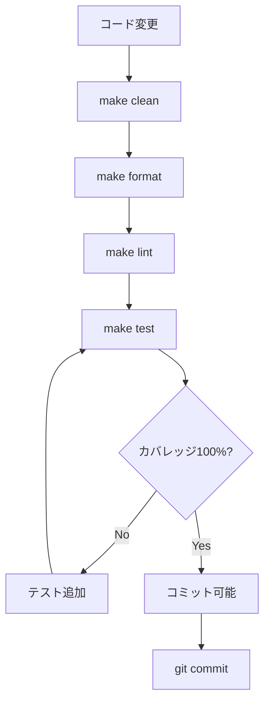

# QUALITY_GUIDE.md

Kumihan-Formatter の品質管理ガイド

## 📋 目次

1. [基本コマンド](#-基本コマンド)
2. [品質チェック詳細](#-品質チェック詳細)
3. [コミット前品質チェック](#-コミット前品質チェック)
4. [自動化オプション](#-自動化オプション)
5. [コミット前クリーンアップ](#-コミット前クリーンアップ)

---

## 🚀 基本コマンド

### テスト実行
```bash
make test
```

### リンター実行
```bash
make lint
```

### コードフォーマット
```bash
make format
```

### 一時ファイル削除
```bash
make clean
```

---

## 🔍 品質チェック詳細

### リンター構成
1. **Black**: コードフォーマットチェック
2. **isort**: インポート整理チェック
3. **flake8**: 構文チェック（E9,F63,F7,F82のみ）

### テスト構成
- **pytest**: テストフレームワーク
- **カバレッジ**: htmlcov/index.html でHTMLレポート確認可能

---

---

## 🤖 自動化オプション

### pre-commitフック設定

**任意の自動化設定**：
```bash
# 初回設定（任意）
pip install pre-commit
pre-commit install

# これ以降、git commit時に自動で品質チェック実行
```

### 利用可能なMakeターゲット

| コマンド | 説明 |
|----------|------|
| `make test` | テスト実行（pytest） |
| `make lint` | リンター実行（コード品質チェック） |
| `make format` | コードフォーマット実行 |
| `make check` | フォーマット・リンター確認のみ（変更なし） |
| `make coverage` | カバレッジ付きテスト実行（HTMLレポート生成） |
| `make pre-commit` | 🚀 コミット前品質チェック（カバレッジ100%必須） |
| `make install` | 開発用依存関係インストール |
| `make clean` | 一時ファイル・キャッシュ削除 |

---

## 🧹 コミット前クリーンアップ

### 必須削除ファイル

**コミット前に必ず削除**：

```bash
# 一時ファイル削除
rm -rf .pytest_cache/ .tmp.*/ __pycache__/ *.pyc *.log
rm -rf *test*.html test*/ dist/test_* *-output/
```

### 削除対象
- `.pytest_cache/`: pytestキャッシュ
- `.tmp.*/`: 一時ディレクトリ
- `__pycache__/`: Pythonキャッシュ
- `*.pyc`: Pythonコンパイル済みファイル
- `*.log`: ログファイル
- `*test*.html`: テスト結果HTMLファイル
- `test*/`: テスト一時ディレクトリ
- `dist/test_*`: 配布用テストファイル
- `*-output/`: 出力ディレクトリ

---

## 📊 品質基準

### 必須基準
- **カバレッジ**: 100%必須
- **フォーマット**: Black + isort 適用
- **リンター**: flake8 エラーなし
- **テスト**: 全てパス

### 推奨基準
- **型ヒント**: 積極的に使用
- **ドキュメント**: 主要クラスに設計参照コメント付与
- **Python**: 3.8+ 対応

---

## 🎯 品質チェックフロー



---

**品質第一で開発を！ 🚀**