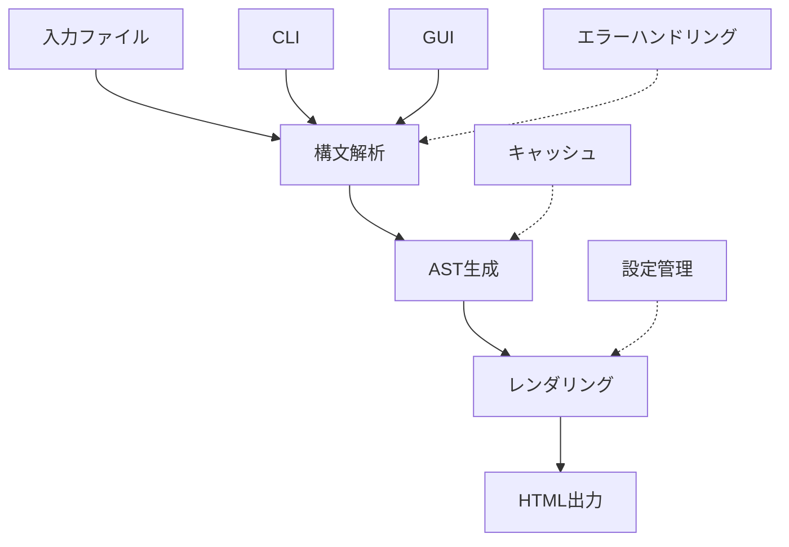

# Kumihan-Formatter テスト戦略 v2.0

> **品質を保ちながら効率的なテスト設計** - ゼロからの根本的見直し
> **作成日**: 2025-01-28
> **対象**: Issue #630 技術的負債解消・テスト戦略見直し

---

## 🎯 戦略概要

### 現状認識
- **現在のテスト資産**: 機能しない、メンテナンス困難
- **開発阻害要因**: テスト修正に開発時間の大半を消費
- **品質目標**: 高度な品質を維持しつつ、開発効率を劇的改善

### 基本方針
**「Contract-First Testing」** - 重要な契約のみテストし、実装詳細はテストしない

---

## 📊 アーキテクチャ分析

### コア価値フロー特定



### 重要度マトリクス

| 機能領域 | ビジネス価値 | 技術リスク | テスト優先度 |
|---------|-------------|-----------|------------|
| **構文解析** | 🔴 Critical | 🔴 High | **P0** |
| **レンダリング** | 🔴 Critical | 🟡 Medium | **P0** |
| **CLI Interface** | 🟡 High | 🟢 Low | **P1** |
| **エラーハンドリング** | 🟡 High | 🟡 Medium | **P1** |
| **キャッシュ機能** | 🟢 Medium | 🔴 High | **P2** |
| **GUI** | 🟢 Medium | 🟡 Medium | **P3** |
| **パフォーマンス** | 🟢 Low | 🟡 Medium | **P3** |

---

## 🏗️ 3層テスト戦略

### Layer 1: Contract Tests (30%)
**目的**: 重要な公開インターフェースの契約を保証

```python
# 例: 構文解析の契約テスト
def test_parser_contract():
    """基本的な構文が正しく解析されることを保証"""
    input_text = ";;;太字;;;強調テキスト;;;"
    result = KumihanParser().parse(input_text)

    assert result.type == "bold"
    assert result.content == "強調テキスト"
    # 実装詳細はテストしない
```

**対象**:
- `KumihanParser.parse()` - 構文解析契約
- `HTMLRenderer.render()` - レンダリング契約
- `ConvertCommand.execute()` - CLI契約
- `FileOperations.read/write()` - ファイルIO契約

### Layer 2: Integration Tests (60%)
**目的**: コンポーネント間の連携とエンドツーエンドフローを検証

```python
def test_full_conversion_pipeline():
    """入力→解析→レンダリング→出力の全フローテスト"""
    input_file = create_test_file("sample.txt")
    output_file = "output.html"

    # 実際のコマンド実行
    result = subprocess.run([
        "python", "-m", "kumihan_formatter",
        "convert", input_file, output_file
    ])

    assert result.returncode == 0
    assert Path(output_file).exists()

    # 出力品質の最小限チェック
    content = Path(output_file).read_text()
    assert "<html>" in content
    assert "太字" in content
```

**スコープ**:
- 基本変換フロー
- エラーケースハンドリング
- ファイル形式対応
- CLI/GUIインターフェース

### Layer 3: Property-Based Tests (10%)
**目的**: 大量のランダム入力でエッジケースを発見

```python
from hypothesis import given, strategies as st

@given(st.text(min_size=1, max_size=1000))
def test_parser_never_crashes(input_text):
    """どんな入力でもパーサーがクラッシュしない"""
    try:
        result = KumihanParser().parse(input_text)
        # 結果の詳細は問わない、クラッシュしなければOK
        assert result is not None
    except KnownParsingError:
        # 既知のエラーは許容
        pass
```

---

## 🚀 実装フェーズ計画

### Phase 1: 基盤整備 (Week 1)
**目標**: 最小限のCI/CD環境構築

```yaml
# 新しい .github/workflows/test-v2.yml
name: Test Strategy v2.0
on: [push, pull_request]

jobs:
  contract-tests:
    runs-on: ubuntu-latest
    steps:
      - uses: actions/checkout@v4
      - name: Contract Tests
        run: pytest tests/contracts/ -v --timeout=30

  integration-tests:
    runs-on: ${{ matrix.os }}
    strategy:
      matrix:
        os: [ubuntu-latest, windows-latest, macos-latest]
    steps:
      - name: Integration Tests
        run: pytest tests/integration/ -v --timeout=120
```

**成果物**:
- [ ] 新テストディレクトリ構造
- [ ] 基本CI設定
- [ ] 最初のContract Test

### Phase 2: Contract Tests実装 (Week 2)
**重点**: P0機能の契約テスト作成

```
tests/
├── contracts/           # Contract Tests
│   ├── test_parser_contract.py      # 構文解析契約
│   ├── test_renderer_contract.py    # レンダリング契約
│   └── test_cli_contract.py         # CLI契約
├── integration/         # Integration Tests
│   ├── test_full_pipeline.py       # E2Eフロー
│   └── test_error_scenarios.py     # エラーケース
└── properties/          # Property-based Tests
    └── test_robustness.py          # 堅牢性テスト
```

**品質基準**:
- Contract Tests: 30テスト以内
- 実行時間: 30秒以内
- 失敗率: 0%

### Phase 3: Integration Tests実装 (Week 3-4)
**重点**: 実用的なエンドツーエンドテスト

**テストシナリオ例**:
```python
scenarios = [
    # 基本機能
    "basic_formatting",      # 基本的な装飾
    "complex_document",      # 複雑な文書構造
    "japanese_content",      # 日本語処理

    # エラーケース
    "malformed_syntax",      # 不正な構文
    "large_file",           # 大容量ファイル
    "encoding_issues",      # エンコーディング問題

    # プラットフォーム
    "windows_paths",        # Windowsパス処理
    "macos_unicode",        # macOS Unicode処理
]
```

### Phase 4: 旧テスト削除・移行 (Week 5)
**安全な移行手順**:

1. **新テスト品質確認**
   ```bash
   # 新テストでの品質確認
   pytest tests/contracts tests/integration -v
   coverage run --source=kumihan_formatter -m pytest
   coverage report --show-missing
   ```

2. **段階的削除**
   ```bash
   # 旧テストを段階的に無効化
   git mv tests/unit tests/_old_unit
   git mv tests/legacy tests/_old_legacy

   # CI設定更新
   # pytest tests/ → pytest tests/contracts tests/integration
   ```

3. **検証期間** (1週間)
   - 新テストでのCI成功率確認
   - 実際のバグ発見能力確認
   - 実行時間・メンテナンス性評価

---

## 📈 品質メトリクス

### 成功基準

| メトリクス | 現在 | 目標 | 測定方法 |
|-----------|------|------|---------|
| **CI実行時間** | 15-20分 | 3分以内 | GitHub Actions |
| **テスト成功率** | 60-80% | 99%+ | 7日間平均 |
| **メンテナンス時間** | 週20時間 | 週2時間 | 作業ログ |
| **バグ発見率** | 低 | 高 | Issue追跡 |
| **開発速度** | 低下 | 向上 | 機能実装時間 |

### 品質ゲート

```yaml
# 品質基準の自動チェック
quality_gates:
  contract_tests:
    max_execution_time: 30s
    min_success_rate: 100%
    max_test_count: 30

  integration_tests:
    max_execution_time: 120s
    min_success_rate: 95%
    max_test_count: 50

  property_tests:
    max_execution_time: 60s
    min_success_rate: 90%
    hypothesis_examples: 100
```

---

## 🛠️ 技術選択

### テストフレームワーク
- **pytest**: 主要テストフレームワーク
- **hypothesis**: Property-based testing
- **subprocess**: Integration testing
- **tempfile**: テストデータ管理

### CI/CD最適化
```yaml
# キャッシュ戦略
cache:
  paths:
    - ~/.cache/pip
    - ~/.hypothesis
    - .pytest_cache

# 並列実行
parallel:
  contract_tests: シーケンシャル実行 (速度重視)
  integration_tests: OS別並列実行
  property_tests: ローカルのみ実行
```

### コード品質
```python
# テストコード品質基準
def good_test():
    """✅ 良いテスト例"""
    # Given: 明確な前提条件
    input_text = ";;;太字;;;内容;;;"

    # When: 一つの操作
    result = parser.parse(input_text)

    # Then: 明確な期待結果
    assert result.type == "bold"
    assert result.content == "内容"
    # 実装詳細はテストしない

def bad_test():
    """❌ 避けるべきテスト例"""
    # 複数の操作、実装詳細のテスト、複雑な前提条件
    pass
```

---

## 🎯 期待効果

### 短期効果 (1ヶ月)
- CI実行時間: 20分 → 3分
- テスト失敗による開発阻害: 大幅削減
- 新機能開発速度: 向上

### 中期効果 (3ヶ月)
- バグ発見率向上
- リファクタリング容易性向上
- 新メンバーの開発参加障壁低下

### 長期効果 (6ヶ月+)
- 安定したリリースサイクル確立
- ユーザー報告バグの削減
- 持続可能な開発体制構築

---

## 🚨 リスク管理

### 主要リスク

1. **新テスト品質不足**
   - 対策: Property-based testingで網羅性確保
   - 対策: 段階的移行で検証期間設定

2. **移行期間の品質低下**
   - 対策: 両方のテストを並行実行
   - 対策: 重要機能は手動テストで補完

3. **チーム慣れの課題**
   - 対策: 詳細ドキュメント・例示
   - 対策: ペアプログラミングでの知識共有

### 回避戦略
- **段階的実装**: 一度に全てを変更しない
- **検証期間**: 各フェーズで品質確認
- **ロールバック計画**: 問題時の旧システム復帰手順

---

## 📋 アクションプラン

### 即座に実行 (今週)
- [ ] 新テストディレクトリ作成
- [ ] 最初のContract Test実装
- [ ] 新CI設定作成

### 1週間以内
- [ ] Phase 1完了: 基盤整備
- [ ] 主要Contract Tests実装
- [ ] チームレビュー・調整

### 1ヶ月以内
- [ ] 全Phase完了
- [ ] 旧テスト削除
- [ ] 成果測定・文書化

---

**この戦略により、品質を保ちながら開発効率を劇的に改善し、持続可能なテスト体制を構築します。**
