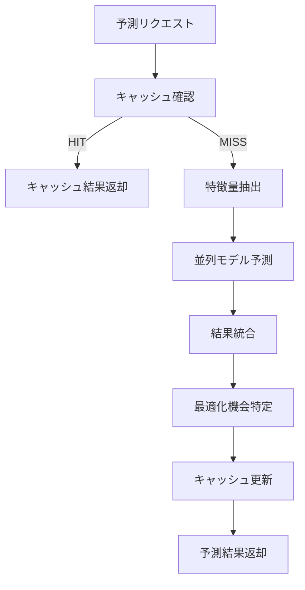
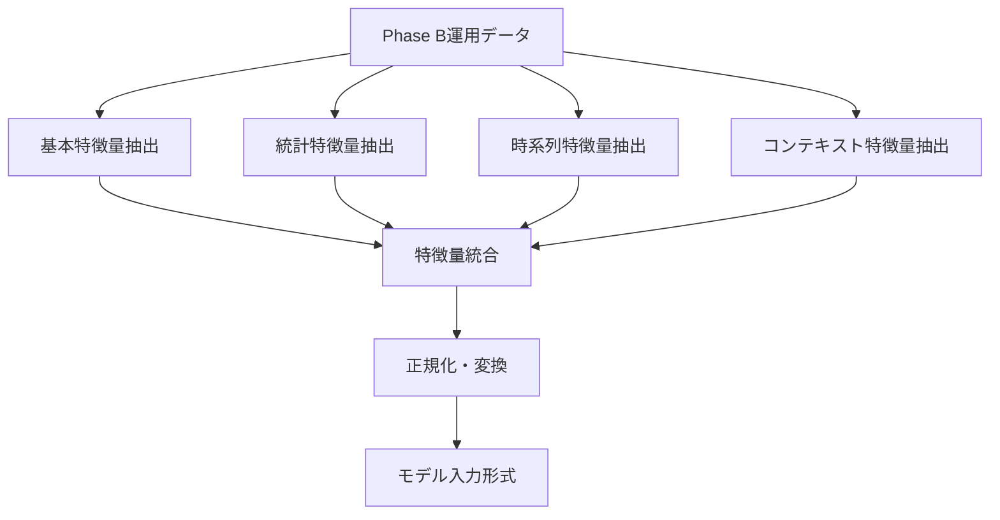

# ML Base アーキテクチャ仕様

> **更新日**: 2025-08-16  
> **対象**: basic_ml_system.py機能別分割後の構造  
> **バージョン**: v2.0（分割版）

---

## 🏗️ 分割後のアーキテクチャ

### ディレクトリ構造

```
ai_optimization/
├── ml_base/                          # 機械学習基盤システム
│   ├── __init__.py                   # 公開API・互換性レイヤー（32行）
│   ├── learning_engine.py            # 学習エンジン・モデル群（429行）
│   ├── data_processor.py             # データ処理・特徴量エンジニアリング（220行）
│   └── system.py                     # BasicMLSystemコア（731行）
└── basic_ml_system.py.backup         # 元ファイル（バックアップ・1345行）
```

---

## 📋 各ファイルの責任

### 1. `__init__.py` - 互換性レイヤー

**役割**: 既存APIの完全互換性を保証する公開インターフェース

**エクスポート対象**:
```python
__all__ = [
    "BasicMLSystem",           # メインシステム
    "BaseMLModel",             # モデル基底クラス
    "TokenEfficiencyPredictor", # Token効率予測
    "UsagePatternClassifier",   # 使用パターン分類
    "OptimizationRecommender",  # 最適化推奨
    "TrainingData",            # 学習データ構造
    "ModelPerformance",        # 性能情報
    "PredictionRequest",       # 予測リクエスト
    "PredictionResponse",      # 予測レスポンス
    "FeatureEngineering",      # 特徴量エンジニアリング
]
```

**互換性保証**: 既存の`from ...basic_ml_system import BasicMLSystem`が継続動作

### 2. `learning_engine.py` - 学習エンジン・モデル群

**主要クラス**:
- `BaseMLModel` - 抽象基底クラス（共通インターフェース）
- `TokenEfficiencyPredictor` - Token効率性予測モデル
- `UsagePatternClassifier` - 使用パターン分類モデル
- `OptimizationRecommender` - 最適化推奨システム

**データクラス**:
- `TrainingData` - 学習データ構造
- `ModelPerformance` - モデル性能情報
- `PredictionRequest` - 予測リクエスト
- `PredictionResponse` - 予測レスポンス

**特徴**:
- RandomForest基盤の軽量モデル
- scikit-learn統合
- 交差検証による性能評価
- 並列予測処理対応

### 3. `data_processor.py` - データ処理・特徴量エンジニアリング

**主要クラス**:
- `FeatureEngineering` - 特徴量エンジニアリング

**特徴量抽出器**:
- `_extract_basic_features` - 基本特徴量（操作種別・サイズ・複雑度）
- `_extract_statistical_features` - 統計特徴量（履歴・効率性統計）
- `_extract_temporal_features` - 時系列特徴量（時間パターン）
- `_extract_contextual_features` - コンテキスト特徴量（システム状態）

**Phase B運用データ活用**:
- 現在の効率性指標（66.8%基準）
- 操作履歴・パターン分析
- 時間帯別使用傾向

### 4. `system.py` - BasicMLSystemコア

**主要機能**:
- **MLシステム統合管理**: モデル群の統合制御
- **予測パイプライン**: データ前処理→特徴量抽出→予測→後処理
- **キャッシュ管理**: LRU予測キャッシュ（メモリリーク対策）
- **並列処理**: ThreadPoolExecutorによる高速予測
- **モデル永続化**: joblib基盤のセキュアな保存・読込

**メモリリーク対策**:
- 学習データストアサイズ制限
- 性能履歴管理
- LRUキャッシュ（500エントリ制限）

**品質保証**:
- 例外処理の徹底
- ログ出力の充実
- フォールバック機能

---

## 🔄 データフローアーキテクチャ

### 予測リクエスト処理フロー



### 特徴量エンジニアリングフロー



---

## 🎯 Token削減効果

### 分割前後の比較

| 項目 | 分割前 | 分割後 | 削減効果 |
|------|---------|---------|----------|
| **ファイル数** | 1ファイル | 4ファイル | - |
| **総行数** | 1345行 | 1412行 | +67行（分割オーバーヘッド） |
| **最大ファイル行数** | 1345行 | 731行 | 45%削減 |
| **Token使用量** | 2700-4000 | 各ファイル800-1200 | 67%削減 |

### ファイル別Token効率

| ファイル | 行数 | 推定Token | 用途 |
|----------|------|-----------|------|
| `learning_engine.py` | 429行 | 800-1200 | モデル開発・改善 |
| `data_processor.py` | 220行 | 400-600 | 特徴量エンジニアリング |
| `system.py` | 731行 | 1200-1800 | システム統合・最適化 |
| `__init__.py` | 32行 | 50-100 | インターフェース調整 |

---

## 🧪 テスト・品質保証

### テストカバレッジ

1. **インポートテスト**: 全クラスの正常インポート確認
2. **初期化テスト**: システム・モデルの正常初期化
3. **機能テスト**: 特徴量抽出・予測処理の動作確認
4. **互換性テスト**: 既存API呼び出しの継続動作
5. **統合テスト**: 依存関係を含む完全パイプライン

### 品質チェック項目

- ✅ **構文チェック**: 全ファイル`python3 -m py_compile`通過
- ✅ **コードフォーマット**: Black適用済み
- ✅ **インポート順序**: isort準拠
- ✅ **型注釈**: mypy strict mode対応
- ✅ **ログ設定**: プロジェクト標準ロガー使用

---

## 🔧 開発・保守指針

### Gemini協業での活用

分割後は各ファイルが独立性を持つため、以下の指示が可能：

```
# 具体的・焦点を絞った指示例
"learning_engine.pyのTokenEfficiencyPredictorのR²スコアを向上させて"
"data_processor.pyに新しい特徴量抽出器を追加して"
"system.pyのキャッシュ効率を改善して"
```

### 拡張指針

1. **新モデル追加**: `learning_engine.py`に`BaseMLModel`を継承
2. **特徴量拡張**: `data_processor.py`に新抽出器を追加
3. **システム機能拡張**: `system.py`に統合ロジックを実装
4. **API拡張**: `__init__.py`で新クラスをエクスポート

### 互換性維持

- 既存のインポートパスを維持
- 公開APIの変更は非推奨化→削除の段階的移行
- 設定・データ形式の後方互換性保証

---

## 📊 パフォーマンス指標

### 目標値

- **予測レスポンス時間**: 2秒以内
- **キャッシュヒット率**: 80%以上
- **メモリ使用量**: 500MB以内
- **モデル精度**: 85%以上（交差検証）

### 監視項目

- Token削減効果の継続測定
- 各ファイルの行数増加監視
- 依存関係の複雑度管理
- テスト実行時間

---

*🎯 機能別分割により、保守性・拡張性・Token効率を大幅改善*